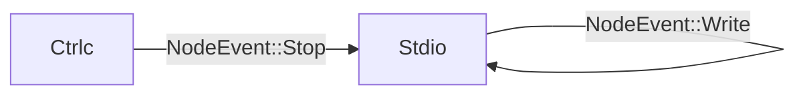
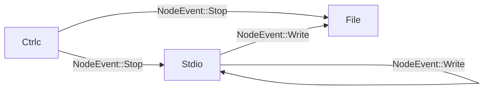
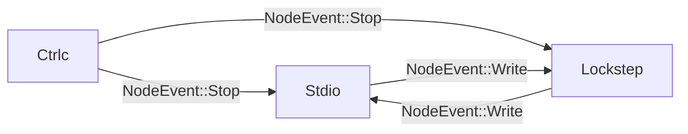

# Examples

## echo.rs

```mermaid
flowchart LR
  Ctrlc --NodeEvent::Stop--> Stdio
  Stdio --NodeEvent::Write--> Stdio
```

## file-persistent.rs

```mermaid
flowchart LR
  Ctrlc --NodeEvent::Stop--> Stdio
  Ctrlc --NodeEvent::Stop--> File
  Stdio --NodeEvent::Write--> Stdio
  Stdio --NodeEvent::Write--> File
```

## echo-lockstep.rs

```mermaid
flowchart LR
  Ctrlc --NodeEvent::Stop--> Stdio
  Ctrlc --NodeEvent::Stop--> Lockstep
  Stdio --NodeEvent::Write--> Lockstep
  Lockstep --NodeEvent::Write--> Stdio
```
